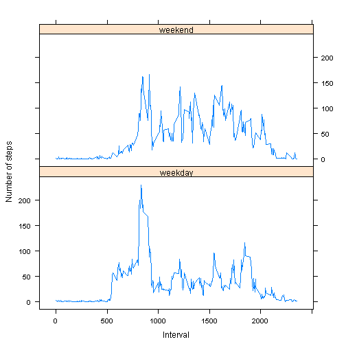

Reproducible Research. Peer Assessment 1
========================================================

## Loading and preprocessing the data


```r
Sys.setlocale("LC_TIME", "English")
```

```
## [1] "English_United States.1252"
```

```r
library(knitr)
data <- read.csv("activity.csv")
data$date <- as.Date(data$date,format("%Y-%m-%d"))
```
 - Create dataframe with total steps per day


```r
library(Hmisc)
```

```
## Loading required package: grid
## Loading required package: lattice
## Loading required package: survival
## Loading required package: splines
## Loading required package: Formula
## Loading required package: ggplot2
## 
## Attaching package: 'Hmisc'
## 
## The following objects are masked from 'package:base':
## 
##     format.pval, round.POSIXt, trunc.POSIXt, units
```

```r
data_pday <- summarize(data$steps, by = data$date, FUN = sum, stat.name='tot_steps',keepcolnames=TRUE)
colnames(data_pday) <- c('date','tot_steps')
```

## What is mean total number of steps taken per day?

### Make a histogram of the total number of steps taken each day


```r
library(ggplot2)
ggplot(data_pday, aes(tot_steps)) +geom_histogram(stat="bin", binwidth = 1000, alpha = 0.5, fill = "blue")+labs(title = "Total number of steps taken each day")+labs(x="Total number of steps taken each day", y="Frequency")
```

 
### The mean and median of the total number of steps taken per day

Mean number of steps per day:


```r
mean(data_pday$tot_steps, na.rm = TRUE)
```

```
## [1] 10766.19
```

Median number of steps per day:


```r
as.numeric(median(data_pday$tot_steps, na.rm = TRUE))
```

```
## [1] 10765
```
## What is the average daily activity pattern?

 - Create dataframe with total steps per interval


```r
data$intervalf <- factor(data$interval)
data_int <- summarize(data$steps, by = data$intervalf, FUN = sum, stat.name='steps', keepcolnames=TRUE, na.rm = TRUE)
colnames(data_int) <- c('interval','tot_steps')
```
 - Make a time series plot (i.e. type = "l") of the 5-minute interval (x-axis) and the average number of steps taken, averaged across all days (y-axis)


```r
plot(data_int$interval,data_int$tot_steps,type="n",main ="The average daily activity", xlab = "5-minute interval", ylab="average number of steps taken")
lines(data_int$interval,data_int$tot_steps,col="green")
```

 

 - Which 5-minute interval, on average across all the days in the dataset, contains the maximum number of steps?


```r
as.vector(data_int[which.max(data_int$tot_steps),1])
```

```
## [1] "835"
```
## Imputing missing values

 - Calculate and report the total number of missing values in the dataset (i.e. the total number of rows with NAs)


```r
sum(is.na(data))
```

```
## [1] 2304
```

 - Devise a strategy for filling in all of the missing values in the dataset. The strategy does not need to be sophisticated. For example, you could use the mean/median for that day, or the mean for that 5-minute interval, etc.

#### Having look at the data, I know thast there are some days only with NAs, so I choose to fill missing values with the mean for that 5-minute interval.
 
 - Create a new dataset that is equal to the original dataset but with the missing data filled in.


```r
#Reset data
testdata <- data

library(zoo)
#Use generic function for replacing each NA with aggregated values.
testdata$steps<- na.aggregate(data$steps, by = data$interval)
```

- Make a histogram of the total number of steps taken each day and Calculate and report the mean and median total number of steps taken per day. Do these values differ from the estimates from the first part of the assignment? What is the impact of imputing missing data on the estimates of the total daily number of steps?


```r
data_new <- summarize(testdata$steps, by = testdata$date, FUN = sum, stat.name='tot_steps',keepcolnames=TRUE)
colnames(data_new) <- c('date','tot_steps')

ggplot(data_new, aes(tot_steps)) +geom_histogram(stat="bin", binwidth = 1000, alpha = 0.5, fill = "blue")+labs(title = "Total number of steps taken each day (NAs replaced)")+labs(x="Total number of steps taken each day", y="Frequency")
```

 
### The mean and median of the total number of steps taken per day (NA replaced)

Mean number of steps per day (NAs replaced):


```r
mean(data_new$tot_steps)
```

```
## [1] 10766.19
```

Median number of steps per day (NAs replaced):


```r
as.numeric(median(data_new$tot_steps))
```

```
## [1] 10766.19
```
The mean (with NAs) and the mean (NAs replaced) are equal.

The median (with NAs)  a little bit lower than the median (NAs replaced).

The mean (NAs replaced) and the median (NAs replaced) are erqual now because the NAs for the day that now is median were replaced by mean.

#### Two histograms for the total number of steps taken each day (with NAs vs NAs replaced)


```r
par(mfrow=c(1,2))

hist(data_pday$tot_steps, main = "With NAs", xlab = "total number of steps taken each day", col="pink")

hist(data_new$tot_steps, main = "NAs replaced", xlab = "total number of steps taken each day", col = "steelblue")
```

 
## Are there differences in activity patterns between weekdays and weekends?

- Create a new factor variable in the dataset with two levels – “weekday” and “weekend” indicating whether a given date is a weekday or weekend day.


```r
testdata$weekday <- weekdays(testdata$date, abbreviate = TRUE)
testdata$weekday <- as.factor(testdata$weekday)
levels(testdata$weekday) <- list("weekday" = c("Mon", "Tue", "Wed", "Thu", "Fri"), "weekend" = c("Sat", "Sun"))
```
 - Make a panel plot containing a time series plot (i.e. type = "l") of the 5-minute interval (x-axis) and the average number of steps taken, averaged across all weekday days or weekend days (y-axis). See the README file in the GitHub repository to see an example of what this plot should look like using simulated data.


```r
data_weekd <- summarize(testdata$steps, by = llist(testdata$weekday, testdata$interval), FUN = mean, stat.name='steps',keepcolnames=TRUE)
colnames(data_weekd) <- c('weekday','interval','steps')
library(lattice)
xyplot(data_weekd$steps ~ data_weekd$interval | data_weekd$weekday,         layout=c(1,2), type="l", xlab = "Interval", ylab = "Number of steps")
```

 

